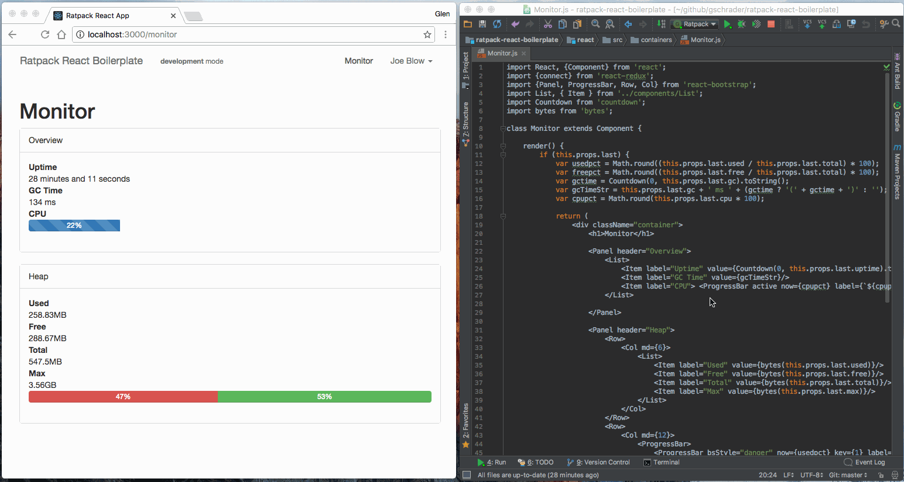

ratpack-react-boilerplate
=====================

An example single page app with the server using Ratpack and the frontend using React. In a development environment the React components can be live edited so that a browser refresh isn't requierd.

It uses [create-react-app](https://github.com/facebookincubator/create-react-app) because who can keep up with all the build configuration required to build javascript these days.

It handles authentication via the Ratpack Pac4j module using JSON Web Tokens (JWT). It has example of using websockets to transfer data from the JVM to the frontend. `AuthenticatorService` performs the authentication, use the same username/password to login.

### Usage

* `gradlew :react:npmInstall` or `npm install` from the `react` directory
* `gradlew :react:npm_start` or `npm start` from the `react` directory
* `gradlew run`
* the browser will open using port 3000

Now edit files under `react/src`.
Your changes will appear without reloading the browser like this:

New npm dependencies can be added to `react/package.json`.

The node server (port 3000) proxies api requests to the Ratpack server.
The Ratpack server (port 5050) will serve up the production optimized built javascript/css assets.

### Node Libraries
 * [React](https://github.com/facebook/react)
 * [Redux](https://github.com/reactjs/redux)
 * [React Bootstrap](Https://github.com/react-bootstrap/react-bootstrap)
 * [React Router](https://github.com/reactjs/react-router)

### Windows ###
The `/ratpack/src/ratpack/template/index.html` should be sym-linked to `/react/build/index.html`. In order to do that you can use PowerShell to create the link with the following command:

`
New-Item -ItemType SymbolicLink -Target react\build\index.html -Path ratpack\src\ratpack\templates\index.html
`
